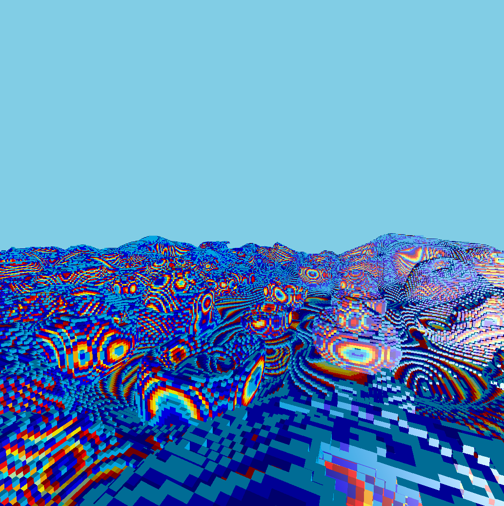
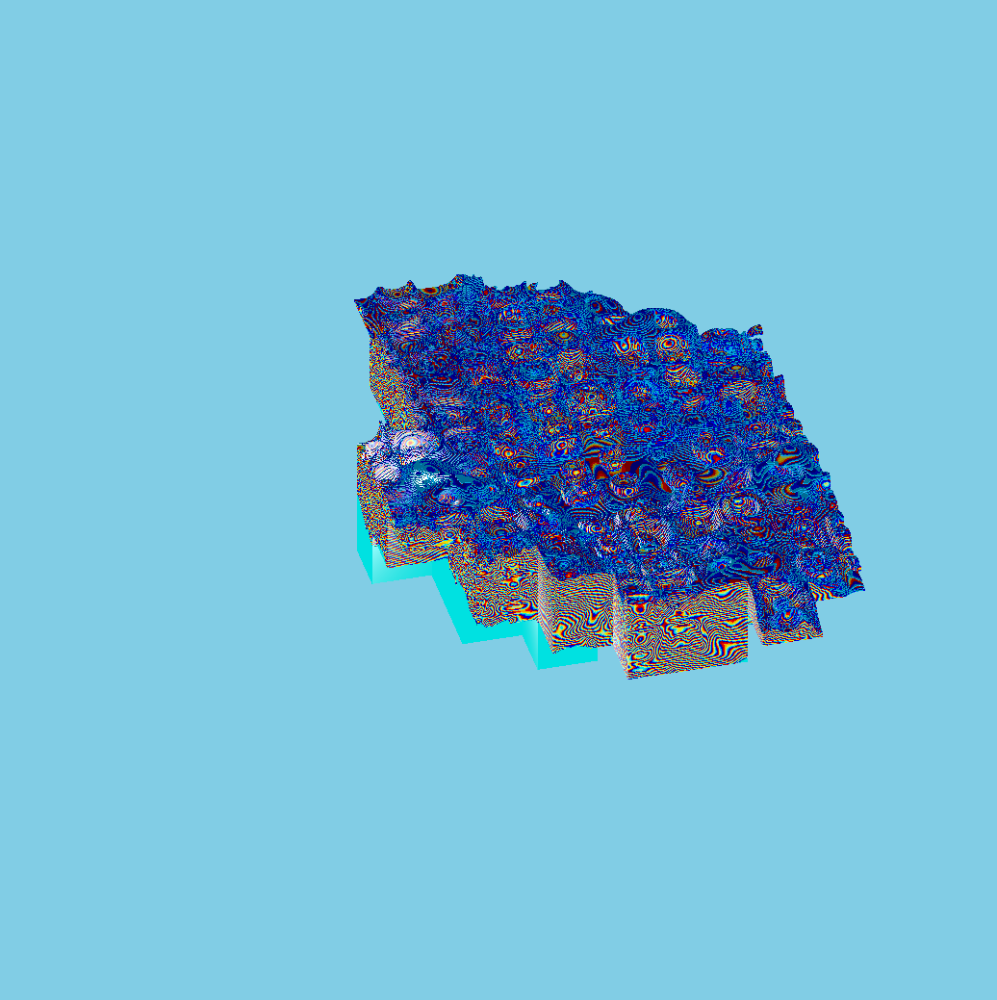

# VE-001

VE-001 is simple minecraft-like (also called chunk based, or boxel based) rendering engine in the form of C++ static library. It was written as a topic of my bachelor degree thesis/senior project.

Engine uses OpenGL 4.5 core API. It utilizes:

    - OpenGL DSA.
    - OpenGL command buffers.
    - OpenGL synchronization using fences.
    - OpenGL persistent+coherent memory mapping.
    - OpenGL compute shaders.
    - C++ thread std library (threads, futures, promises ...).

Engine's memory management system is heavily based on one presented [here](https://nickmcd.me/2021/04/04/high-performance-voxel-engine/). Implementation extends mentioned idea by:

    - Dynamic vertex pool resizing based on voxel data characteristics (greedy meshing algorithm feedback).
    - Greedy meshing algorithm in OpenGL compute shaders.
    - Optimal management of chunk visibility region defined by an ellipsoid based on data structure where each chunk holds reference to its neighbours.
    - Flexible data generator integration (chunk data streamer + generators).

It's not the most performant engine out there, there are lots of ways in which it can be improved such as adding LOD system, better memory managment to increase active memory usage, generated terrain/data I/O to disk, allow chunk modification, better parallelized mesh generation.

Below two screenshots were presented. One how does it look from camera 1st person view and second from orthographic 3rd person view to show visibility region, back face culling and frustum culling effect.

[Here](https://youtu.be/AE6F0OGAWK4) is practical presentation of the engine in sandbox/test application.

Projection camera view |  Ortographic  3rd person view
:-------------------------:|:-------------------------:
  |  

Thesis can be found [here](thesis/19-INFDZN19-43614-80723-109969%20(watermarked).pdf), but be aware - it's in polish.
